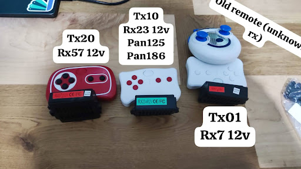
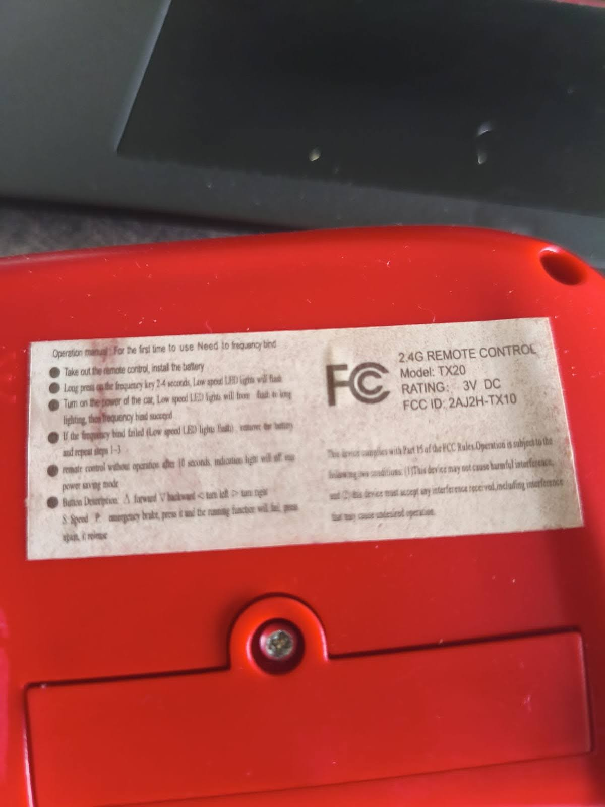
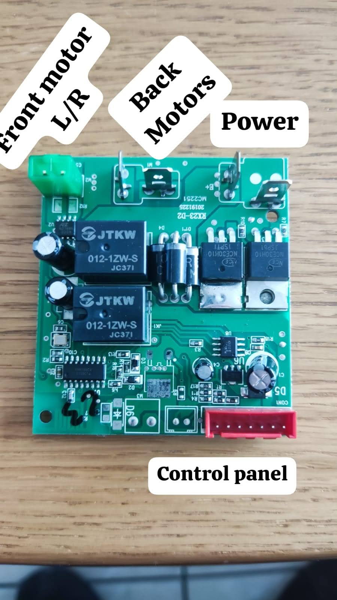
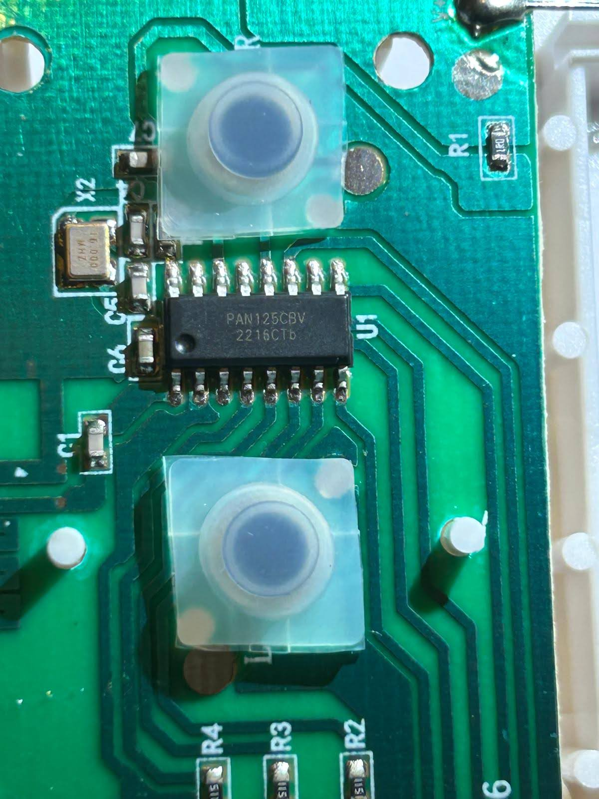
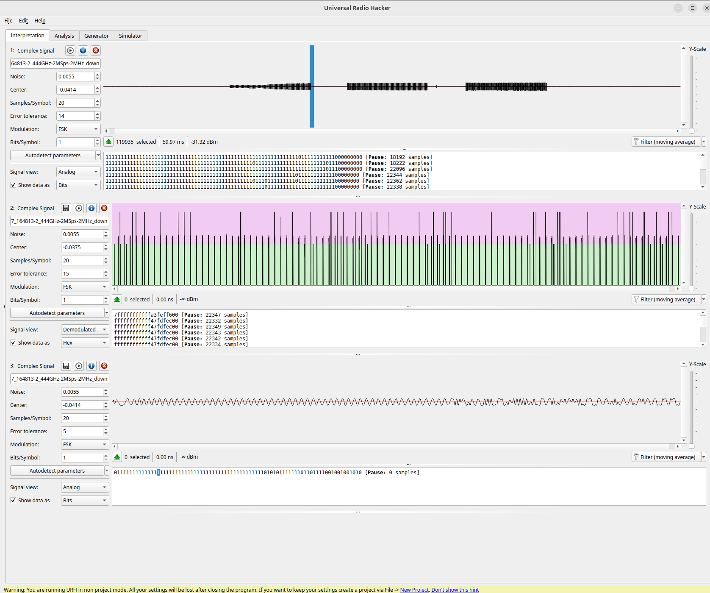

# GoBabyGo Dual-Control Wireless Remote (R\&D)

**Objective**
Build a **dual-control** system for ride-on cars so a **child controller** (buttons/joystick) can drive while the **parent’s stock remote** retains full, immediate **override**—preserving all original safety behavior and requiring no changes to the car’s stock receiver.

---

## Current Status

**Phase:** Research in to reverse engenreing the RF protcol.
**Focus:** Decoding the stock RF protocol to enable safe emulation/mediation.

* Platform under test: **TX20 (remote) → RX23 (car)**, FCC ID **2AJ2H-TX10**
* Band/Modulation: **2.4 GHz**, suspected **GFSK** (bit rate **TBD**)
* RF modal with good probablity is panchip [XN297L](https://www.panchip.com/static/upload/file/20190916/1568621331607821.pdf)
* Tools: **HackRF**, **GNU Radio**, **Universal Radio Hacker (URH)**
* Progress:
  * ✅ Reliable captures of button-press bursts
  * 🔄 Tuning **samples-per-symbol (sps)** / bitrate to stabilize framing
  * 🔍 Identifying preamble/sync, payload layout, and CRC (in progress)

> Goal of this phase: confirm modulation/bitrate, extract a stable frame format, and map commands (FWD/REV/LEFT/RIGHT/STOP).

## ⚡️ RF Protocol Specification & Verified Command (as of 2025-09-19)
The following parameters have been confirmed via a successful transmission script `gfsk_tx20_rx23.py` that reliably controlled the car's receiver.

| Parameter         | Value                            | Notes                      |
| ----------------- | -------------------------------- | -------------------------- |
| Center Freq       | `2.44388 GHz`                    | Matches URH/HackRF capture |
| Sample Rate       | `2.0 MS/s`                       | `SAMP_RATE = 2e6`          |
| Bitrate           | `250 kbps`                       | `SAMP_RATE / SPS`          |
| SPS (samples/sym) | `8`                              | `SPS = 8`                  |
| Modulation        | 2-FSK                            | Narrow-band GFSK-like      |
| FSK Tones         | `F0 = 28320 Hz`, `F1 = 56641 Hz` | Matches URH deviations     |
| HackRF Gains      | TX: `40`, IF: `21`, BB: `20`     | Script default             |
| Repeat/Burst      | 5 bursts, 50 ms gap              | Reliable transmission      |

> ℹ️ Note: While the stock remote likely uses GFSK (e.g., XN297L datasheet), our working GNU Radio transmission uses 2-FSK without shaping — and it successfully activates the car.

* **LEFT**: `gfsk_tx20_rx23.py "07ffffffffffffffffffffffffffffe3887aafda352d50a4119a0"`

* **FOWARD**: `gfsk_tx20_rx23.py "07ffffffffffffffffffffffffffffe3887aafda352d5262ce728"`

---

## How You Can Help

* Share short IQ captures of your **TX20/RX23** (or similar) with notes (frequency, sample rate, button pressed).
* Report hardware variants (photos/labels/PCBs).
* Open issues with any repeatable observations (idle beacons, pairing behavior, etc.).

---

## Links (repo)

* Google docs with some notes about the project -  https://docs.google.com/document/d/1At2ocUe9gaYEEyBYa_aoBxoMLpggaP__u1GeCZVrkBw/edit?usp=sharing

