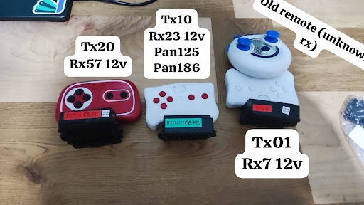
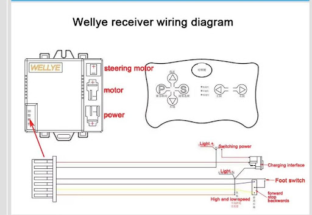
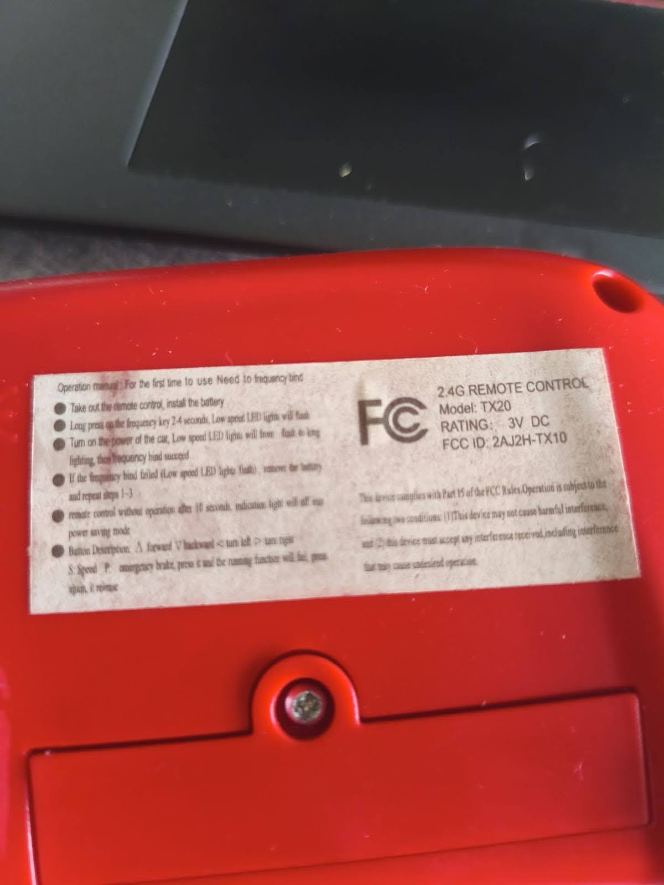
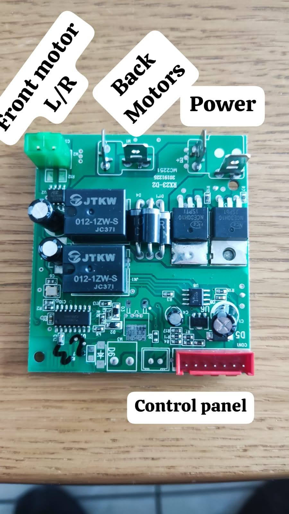
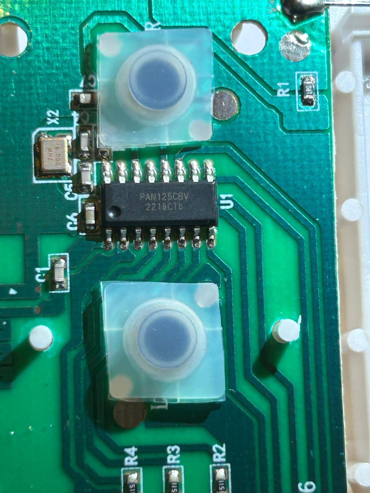
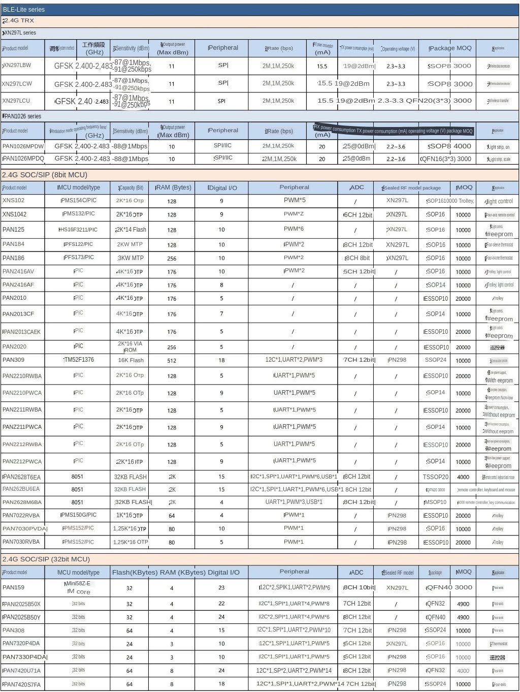
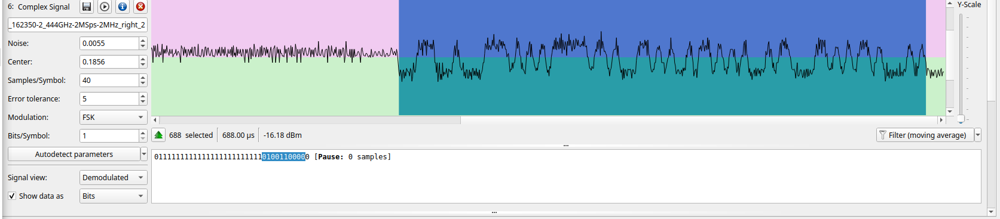
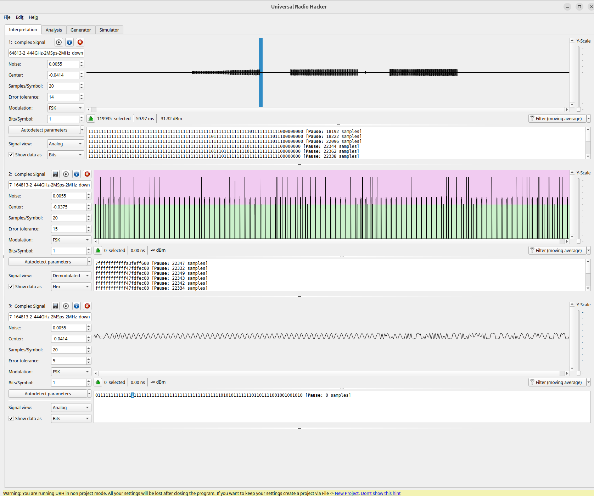

# GoBabyGo Dual-Control Wireless Remote (R&D)

> **Empowering children with custom ride-on car controls—without sacrificing safety or compatibility.**

---

## 🎯 Project Overview

This project aims to design and build a **dual-control wireless system** for adapted ride-on cars used in [GoBabyGo](https://www.gobabygo.org.il/) initiatives.

The system introduces a **child-friendly controller** (such as push buttons or a joystick) that can drive the vehicle—**while preserving full override capabilities of the parent’s stock remote**. Our solution is non-invasive, meaning it requires **no modification to the car’s internal electronics or receiver**.

We believe mobility and independence should be accessible to all children, especially those who benefit from adaptive technologies.

### Why It Matters

- ✨ **Empowerment**: Children gain agency through active control of their vehicle.
- 🧠 **Safety**: The original parent remote maintains full override capability at all times.
- 🔌 **Compatibility**: The system is designed to work *alongside* the stock controller and receiver—no internal rewiring or soldering required.

> This approach extends the capabilities of existing GoBabyGo adaptations. While many systems only offer hardcoded forward motion, our dual-controller setup enables **custom directional control**—left, right, forward, and reverse—using adaptive buttons tailored for the child’s needs.

---

## 🔧 System Design Approach

Our core design philosophy is **non-invasive compatibility**. Rather than replacing or modifying the car’s receiver, we aim to **introduce a secondary controller** that operates in harmony with the existing system.

Key steps:

1. **RF Protocol Reverse Engineering**  
   Capture and analyze the stock remote’s RF signals to understand modulation, framing, and command layout.

2. **Custom Controller Development**  
   Build a programmable transmitter that:
   - **Listens to and relays** commands from the stock remote (preserving override)
   - **Injects its own commands** from child-initiated inputs (e.g., buttons or joystick)

3. **Mediation Software Logic**  
   Design control logic that prioritizes safety by always deferring to the parent’s original remote if both attempt to control simultaneously.

> This results in a **child-safe**, **parent-controlled**, and **fully wireless** dual input system.

---

## 📡 Current Status

**Phase:** RF reverse engineering and protocol decoding of produced by **weelye**.
**Focus:** Safely emulating the stock remote behavior and identifying opportunities for dual control

| Item                  | Status |
|-----------------------|--------|
| Target System         | TX20 (remote) → RX23 (car) |
| Tools Used            | HackRF, GNU Radio, Universal Radio Hacker (URH) |
| RF SoC (likely)       | [XN297L](https://www.panchip.com/static/upload/file/20190916/1568621331607821.pdf) |
| FCC ID                | [2AJ2H-TX10](https://fcc.report/FCC-ID/2AJ2H-TX10) |
| Protocol Progress     | ✅ Working emulated packets   🔄 Refining bitrate, timing, CRC   🔍 Mapping dual-button behavior |

For full technical details, packet layouts, timing analysis, and verified captures, see:  
👉 [RX23 TX20 Analysis](./RX23_TX20.md)

---

## 🤝 How You Can Help

We welcome help from hackers, engineers, makers, and families!

### 👩‍🔬 Reverse Engineering
- Help analyze and document RF protocols of other ride-on car systems (**weelye** RX75, etc.)
- Share URH or HackRF captures of your remotes
- Confirm observed behavior with your specific models

### 🔩 Hardware & Control Design
- Suggest or prototype adaptive input devices (e.g., large push buttons, joysticks, assistive switches)
- Design low-power embedded transmitter boards (e.g., XN297L, nRF24L01, etc.)
- Help design and implement the software required
- Help implement physical enclosures, harnesses, or interface mounts

### 🌐 Outreach & Testing
- Test across different car models and remotes
- Assist with documentation, photos, and video demos
- Connect with other GoBabyGo chapters for broader input and validation

---

## Links (repo)
- [TX20 FCC ID](https://fcc.report/FCC-ID/2AJ2H-TX10)
- [XN297L Datasheet](https://www.panchip.com/static/upload/file/20190916/1568621331607821.pdf)
- [TX20 GNU Radio TX Script](../scripts/gfsk_tx20_rx23.py)

