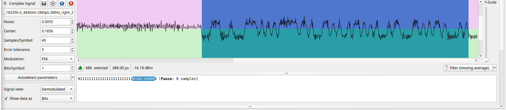

# GoBabyGo Dual-Control Wireless Remote (R\&D)

**Objective**
Build a **dual-control** system for ride-on cars so a **child controller** (buttons/joystick) can drive while the **parent’s stock remote** retains full, immediate **override**—preserving all original safety behavior and requiring no changes to the car’s stock receiver.

---

## Current Status

**Phase:** Research in to reverse engenreing the RF protcol.
**Focus:** Decoding the stock RF protocol to enable safe emulation/mediation.

* Platform under test: **TX20 (remote) → RX23 (car)**, FCC ID **2AJ2H-TX10**
* Band/Modulation: **2.4 GHz**, suspected **GFSK** (bit rate **TBD**)
* Tools: **HackRF**, **GNU Radio**, **Universal Radio Hacker (URH)**
* Progress:
  * ✅ Reliable captures of button-press bursts
  * 🔄 Tuning **samples-per-symbol (sps)** / bitrate to stabilize framing
  * 🔍 Identifying preamble/sync, payload layout, and CRC (in progress)

> Goal of this phase: confirm modulation/bitrate, extract a stable frame format, and map commands (FWD/REV/LEFT/RIGHT/STOP).

---

## How You Can Help

* Share short IQ captures of your **TX20/RX23** (or similar) with notes (frequency, sample rate, button pressed).
* Report hardware variants (photos/labels/PCBs).
* Open issues with any repeatable observations (idle beacons, pairing behavior, etc.).

---

## Links (repo)

* Google docs with some notes about the project -  https://docs.google.com/document/d/1At2ocUe9gaYEEyBYa_aoBxoMLpggaP__u1GeCZVrkBw/edit?usp=sharing

